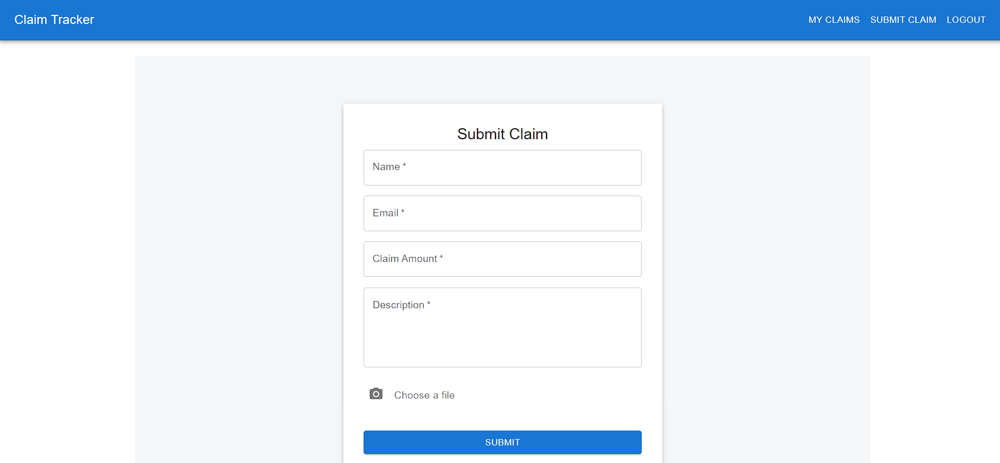

# Insurance Claims Management System

Welcome to the Insurance Claims Management System! This application simplifies the process of submitting and reviewing insurance claims.
This system allows:

* **Patients:** To easily submit insurance claims online with supporting documents.
* **Insurers:** To efficiently review and manage claims from a centralized dashboard.

## Key Features

* **Centralized Insurer Dashboard:** Insurers have a clear overview of all claims with filtering options.
    
* **Easy Claim Submission:** Patients can quickly fill out claim details and upload documents.
    
* **User Registration:** New patients can easily register for an account.
    
* **User Login:** Existing users can log in to access their dashboards.
    
* **Patient Claim View:** Patients can view their submitted claims and track their status.
    
* **Claim Review and Approval:** Insurers can review claim details, documents, and provide feedback, including approving or rejecting claims.
    
* **Real-time Status Updates:** Patients can track the status of their claims.

## Technical Documentation

For detailed technical information, please refer to the `insurance-claims-backend/README.md` and `insurance-claims-frontend/README.md` files located within the respective backend and frontend folders.

## Contact

For any questions or support, please contact: [rahmanasif158@gmail.com](mailto:rahmanasif158@gmail.com)

---